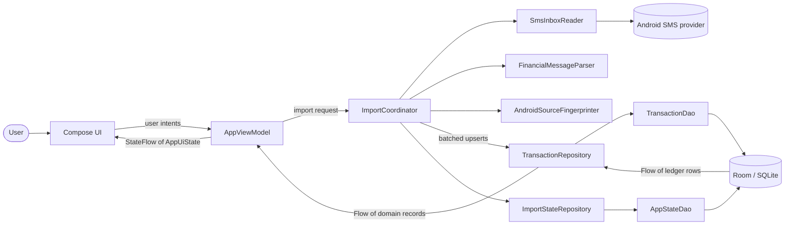
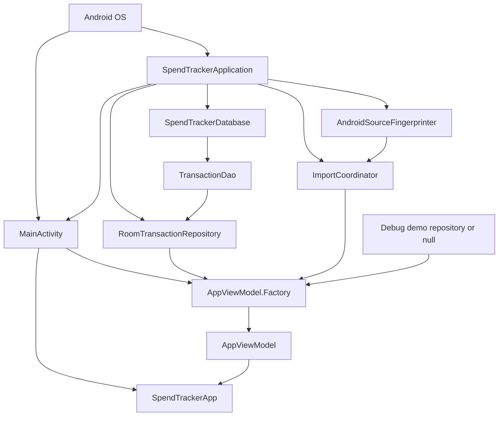
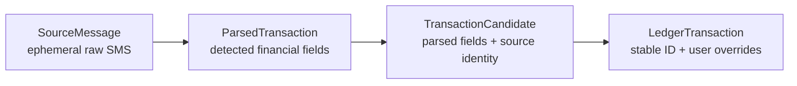
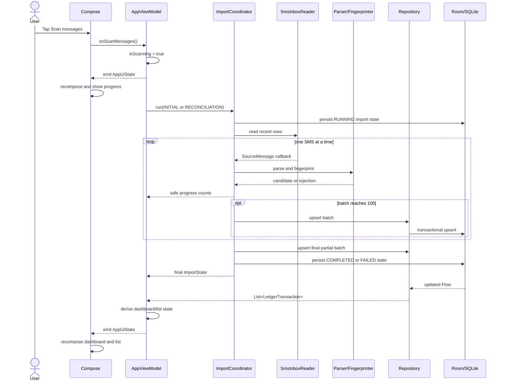
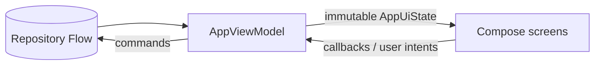
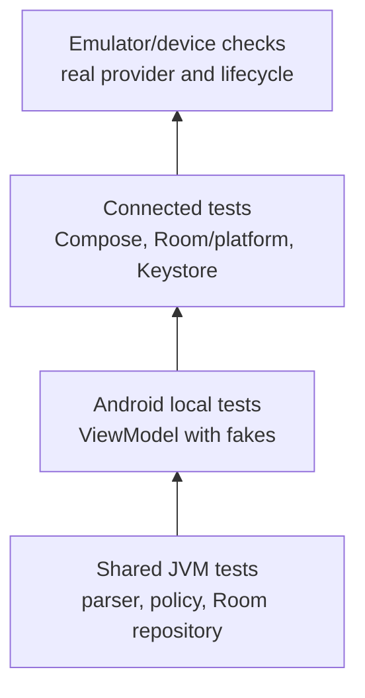

# SpendTracker low-level design

## 1. Purpose and audience

This document explains the implemented SpendTracker codebase to a developer who
is new to the project and may also be new to Android. It describes the runtime
objects, important classes, data flow, state flow, persistence, privacy
boundaries, and tests.

Code is the source of truth. This document describes the repository as of
2026-09-05. Items described as future work come from `MVP_PLAN.md` and must not
be mistaken for implemented behavior.

## 2. System summary

SpendTracker is an Android-first, offline application. It reads recent financial
SMS messages after the user grants permission, parses supported messages on the
device, saves privacy-safe transaction fields and import status in Room/SQLite,
and renders the ledger through Jetpack Compose.

MVP-03 replaced the original all-at-once scanner with a durable, batched
`ImportCoordinator`. The coordinator, permission lifecycle, persistence,
cancellation/retry UI, and foreground reconciliation described below are wired
and verified.



The main architectural rule is that dependencies point from Android UI and
platform integration toward shared domain contracts. Compose screens never
query SMS or Room directly.

## 3. Module and source-set layout

```text
SpendTracker
├── androidApp
│   ├── src/main       production Android activity, services, and Compose UI
│   ├── src/debug      debug-only demo dependency implementation
│   ├── src/release    release dependency implementation without demo data
│   ├── src/test       local JVM Android tests
│   └── src/androidTest emulator/device tests
└── shared
    ├── src/commonMain portable models, parser, database, DAO, and repository
    ├── src/commonTest portable tests
    ├── src/androidMain Android Room database-path construction
    ├── src/jvmMain    JVM Room database-path construction
    ├── src/jvmTest    host-side Room/repository tests
    └── src/iosMain    iOS Room database-path construction
```

### 3.1 `androidApp`

This is the executable Android application. It owns code that requires Android
framework types: `Activity`, `Application`, runtime permissions, Android
Keystore, the SMS content provider, Compose UI, and Android resources.

### 3.2 `shared`

This is a Kotlin Multiplatform module. `commonMain` cannot refer to Android
classes. It contains portable financial rules and the Room KMP schema so those
parts can be compiled and tested on JVM, Android, and supported iOS targets.

### 3.3 Gradle relationships

`settings.gradle.kts` includes both modules. `androidApp` declares
`implementation(project(":shared"))`, so Android code may use shared classes.
The inverse dependency does not exist.

The project uses JDK/JVM 17, Android minimum API 26, compile/target API 37,
Compose Material 3, coroutines, Room 3 KMP, KSP, and bundled SQLite. Dependency
versions are centralized in `gradle/libs.versions.toml`.

## 4. Runtime object graph

An object graph answers: which long-lived objects exist, who creates them, and
who shares them?



### 4.1 `SpendTrackerApplication`

Android creates one `SpendTrackerApplication` for the app process because it is
registered as `android:name` in the manifest. It is the composition root for
production dependencies:

- lazily creates `SpendTrackerDatabase`;
- creates `RoomTransactionRepository` from the DAO;
- creates `AndroidSourceFingerprinter`;
- creates `ImportCoordinator` and the import-state repository;
- coordinates full local deletion in database-then-key order.

`by lazy` means an object is created only on first access and then reused. This
keeps the database and repository stable across Activity recreation.

### 4.2 `MainActivity`

`MainActivity` is the single Android screen container. Its responsibilities are
deliberately narrow:

- obtain application-scoped dependencies;
- create `AppViewModel` with `AppViewModel.Factory`;
- create the Compose hierarchy with `setContent`;
- launch the Android `READ_SMS` permission dialog;
- recheck permission in `onResume`.

It does not parse messages, run SQL, or calculate dashboard totals.

### 4.3 Constructor injection

Objects receive collaborators through constructors. For example,
`AppViewModel` receives the `ImportRunner` boundary, while
`RoomTransactionRepository` receives a DAO and a clock function. Tests can
therefore provide deterministic fakes without starting Android services.

There is intentionally no dependency-injection framework. The application and
factory form a small manual DI setup.

## 5. Domain model

The shared model separates four stages of a transaction's life.



### 5.1 `SourceMessage`

Represents one SMS row while it is being processed:

- provider row ID;
- sender;
- raw body;
- received timestamp.

This object is ephemeral. Its raw body must never be stored or logged.

### 5.2 `Money`

Stores a non-negative `Long amountMinor` and a `CurrencyCode`. Minor units avoid
floating-point errors: `INR 499.00` is stored as `49_900` paise. The separate
currency preserves the original value and prevents currencies from being added
together accidentally.

### 5.3 `ParsedTransaction`

Contains parser-produced fields: money, debit/credit direction, kind, detected
category, merchant, masked account hint, confidence, timestamp, and parser
version.

Its computed `isIncludedInSpend` is true only for debit purchases and fees.
Credits, refunds, transfers, and ATM withdrawals remain visible but do not count
as ordinary spend.

### 5.4 `TransactionCandidate`

Wraps a parsed transaction with `SourceType`, optional provider ID, and keyed
source fingerprint. This is the privacy-safe input accepted by the repository.

### 5.5 `LedgerTransaction`

Represents a persisted ledger record. It adds a stable ID and nullable user
overrides. Effective values follow these precedence rules:

```text
effectiveCategory = userCategory ?: detectedCategory
effectiveIncluded = userIncludedInSpend ?: detectedIncluded
```

Kotlin's `?:` Elvis operator means “use the left value unless it is null;
otherwise use the right value.” A re-import may update detected data but must
not erase an explicit user correction.

## 6. SMS import pipeline

### 6.1 Permission boundary

The manifest declares `READ_SMS`; `MainActivity` checks and requests it at
runtime only after the in-app disclosure and user action. The UI/ViewModel also
guards import actions, so an import is ignored if permission is absent or another
import is active. Persisted request history distinguishes first use, retryable
denial, permanent denial, and permission revoked after a completed import.

### 6.2 Inbox reader

`SmsInboxReader` implements the shared `MessageSource` interface. It receives an
explicit cutoff, queries `Telephony.Sms.Inbox.CONTENT_URI`, and asks only for ID,
address, body, and date. `CalendarHistoryCutoffProvider` calculates the initial
`now - 3 calendar months` boundary with an injectable clock and time zone.

The query runs in `withContext(Dispatchers.IO)` so blocking provider work does
not freeze the main UI thread. A `Cursor` is consumed one row at a time. Each
`SourceMessage` is passed immediately to a suspending callback; the reader never
builds a list of raw messages. Suspending allows the coordinator to flush a
bounded transaction batch before requesting the next row.

### 6.3 Parser

`FinancialMessageParser` is deterministic shared code. For each message it:

1. normalizes whitespace;
2. rejects blank, OTP, declined, failed, cancelled, and authorization-only text;
3. extracts a supported currency and exact amount;
4. classifies purchase, transfer, withdrawal, refund, fee, or unknown;
5. detects debit or credit direction;
6. extracts a merchant and account hint when possible;
7. applies ordered keyword category rules;
8. assigns confidence and parser version.

Returning `null` means the message is currently unsupported or intentionally
ignored. Rejection reasons are planned but not implemented.

### 6.4 Fingerprinter

`AndroidSourceFingerprinter` normalizes sender, timestamp, and body, separates
them with NUL characters, and computes HMAC-SHA256 using a non-exportable key in
Android Keystore.

The digest supports deduplication without storing the message body. It is keyed
rather than a plain hash because financial messages can be predictable. Full
local deletion first clears stored rows and then deletes this key.

### 6.5 Import coordinator

`ImportCoordinator` is the shared orchestration layer introduced by MVP-03. It
joins the message source, parser, fingerprinter, transaction repository, import-
state repository, cutoff provider, and clock.

It supports two modes:

- `INITIAL` starts at the three-calendar-month cutoff;
- `RECONCILIATION` starts at the later of that cutoff or five minutes before
  the previous successful scan, so a small overlap catches boundary races.

It changes durable status to `RUNNING`, processes one source message at a time,
and flushes accepted candidates in batches of 100. It reports only safe counts:
scanned, recognized, rejected, needs-review, and newly saved. Completion or a
coarse failure code is persisted. Cancellation is recorded as `INTERRUPTED` in
a `NonCancellable` block and then rethrown.

Because a coroutine cannot survive process death, startup converts any restored
`RUNNING` row to `FAILED/INTERRUPTED` before observing it. This makes retry
available instead of displaying a scan that no longer has a process-local job.
Likewise, a null cursor from the Android SMS provider throws a source failure;
only a valid cursor containing zero rows represents an empty inbox.

The transaction repository's idempotent upsert makes retries and reconciliation
overlap safe. Counts before and after a batch report how many new ledger rows
were actually saved.

### 6.6 Sequence for a successful scan



## 7. Persistence design

### 7.1 Room database

`SpendTrackerDatabase` is at schema version 2 and uses Room KMP with bundled SQLite.
KSP generates the database implementation. Platform source sets provide only
the database path; common code supplies the schema, driver, DAO, and repository.

The version-1 schema is exported to
`shared/schemas/com.spendtracker.core.database.SpendTrackerDatabase/1.json` for
migration verification. Version 2 adds durable run status, attempt/progress/
failure fields, and permission-request history through `MIGRATION_1_2`; its
schema fixture is exported and the migration is covered by a JVM reopen test.

### 7.2 Tables

| Table | Current responsibility |
| --- | --- |
| `transactions` | Parsed ledger, source identity, detection fields, overrides, timestamps |
| `import_state` | Durable status, completion, attempt/success times, safe counts, parser version, coarse failure |
| `merchant_category_rules` | Future user-approved merchant/category mappings |
| `settings` | Durable local preferences and SMS permission-request history |

Raw SMS body and sender are intentionally absent from every table.

### 7.3 `TransactionDao`

The DAO is the SQL boundary. Room implements its annotated methods. It provides:

- observable chronological list;
- lookup by app ID, fingerprint, or provider ID;
- insert/update and override updates;
- deletion and count;
- period, category-total, and needs-review queries;
- transactional batch upsert.

`@Transaction` makes `upsertAll` atomic. Other observers cannot see a half-
finished import.

### 7.4 `AppStateDao` and import-state repository

`AppStateDao` reads and replaces the singleton `import_state` and `settings`
rows. `RoomImportStateRepository` maps persisted strings/counters to the domain
`ImportState` model and supplies safe defaults on a fresh installation. Its
observed `Flow<ImportState>` is the durable source needed to restore onboarding,
progress, retry, and completion UI after process death.

### 7.5 Deduplication algorithm

Two unique identities exist:

- `(sourceType, sourceFingerprint)` is authoritative;
- `(sourceType, sourceProviderId)` is useful when the Android row still exists.

For each candidate:

```text
fingerprint already exists?
├── yes: update detected fields on that stable row
│        preserve ID, created time, and user overrides
│        resolve any provider-ID collision
└── no:  clear a reused provider ID from its old row, if necessary
         insert this as a new fact
```

This handles repeated scans, concurrent import paths, and Android provider-row
ID reuse without overwriting a genuinely different transaction.

### 7.6 Repository mapping

`RoomTransactionRepository` keeps Room-specific entities out of the rest of the
application. It maps:

```text
TransactionCandidate → TransactionEntity → SQLite
SQLite row → TransactionEntity → LedgerTransaction
```

Enums are serialized with their stable `.name` values. The injected clock
supplies consistent `createdAt` and `updatedAt` timestamps and makes tests
deterministic.

`InMemoryTransactionRepository` implements the same interface for debug demo
mode and ViewModel tests. It mirrors ordering, fingerprint deduplication, and
override preservation, but intentionally loses data when the process exits.

## 8. UI architecture

### 8.1 Unidirectional data flow



State travels down; events travel up. Compose screens do not mutate repository
or ViewModel fields directly.

### 8.2 `AppUiState`

The top-level immutable snapshot includes:

- onboarding versus main stage;
- permission state;
- selected bottom destination;
- scan-in-progress flag, summary, and safe error code;
- demo availability/selection;
- dashboard state;
- transaction-list state.

Updates use `data class.copy`, producing a new snapshot rather than mutating the
old one.

### 8.3 `AppViewModel`

The ViewModel owns mutable UI state and exposes only read-only `StateFlow`. It:

- receives permission and navigation intents;
- launches and cancels imports in `viewModelScope`;
- observes durable import status and safe progress;
- observes either production or demo repository, never both at once;
- derives included INR totals and foreign-transaction counts;
- maps failures to a coarse `SCAN_FAILED` state without sensitive details.

It calls `ImportRunner` for initial or reconciliation work, restores completed
onboarding state after process death, and initiates an overlap reconciliation
when a completed app resumes with permission.

The current dashboard total covers all repository rows. Calendar week/month
aggregation is planned for MVP-07.

### 8.4 Compose observation and recomposition

`SpendTrackerApp` calls `collectAsStateWithLifecycle()` on the ViewModel's
`StateFlow`. When the ViewModel emits a new `AppUiState`, Compose reruns the
affected composable functions. For example:

```text
isScanning false → true
├── scan button becomes disabled
└── progress indicator becomes visible
```

The UI never calls “show progress indicator.” It describes what should be
visible for the current state. This is declarative UI.

### 8.5 Screen routing

`SpendTrackerAppContent` first selects onboarding or the main shell from
`AppStage`. The main `Scaffold` renders a Material bottom navigation bar and
selects Dashboard, Transactions, or Settings from `TopLevelDestination`.

This is a small enum-based router, not Navigation Compose. It is sufficient for
the current flat screens but has no back stack or deep links.

### 8.6 Screen responsibilities

| File | Responsibility |
| --- | --- |
| `OnboardingScreen` | Privacy explanation, permission action, scan action, progress/error, debug demo entry |
| `DashboardScreen` | Included INR total, included count, foreign count, empty state |
| `TransactionsScreen` | Chronological lazy list, money/date/category labels, accessibility semantics |
| `SettingsScreen` | Permission/scan summary and demo exit; full privacy controls are future work |
| `CommonComponents` | Reusable headers, information cards, and demo banner |
| `DisplayFormatters` | Minor-unit money, local dates, enum-to-resource mapping |
| `Theme` | Material 3 light/dark color schemes |

Screens receive data and callbacks as parameters. This state hoisting keeps them
previewable and testable without Android services.

## 9. Lifecycle and concurrency

| Mechanism | Why it is used |
| --- | --- |
| `Application` scope | Reuse database/repository while the process lives |
| `ViewModel` | Preserve UI state across Activity configuration recreation |
| `viewModelScope.launch` | Run work tied to ViewModel lifetime |
| `Dispatchers.IO` | Keep blocking SMS provider query off main thread |
| Room query coroutine context | Keep SQLite work off UI rendering |
| `Flow` | Push database changes toward ViewModel automatically |
| `StateFlow` | Hold and publish the latest UI snapshot |

`CancellationException` is rethrown in the ViewModel. Cancellation is normal
coroutine control flow and must not be converted into a user-visible scan error.

Current limitation: live `RECEIVE_SMS` ingestion has not yet been implemented;
foreground overlap reconciliation is the current recovery mechanism.

## 10. Build variants and demo data

Both debug and release source sets provide an object named
`BuildVariantDependencies`:

- debug returns an in-memory repository seeded with synthetic transactions;
- release returns `null`.

Only one implementation is compiled into a given variant. Production builds
therefore cannot construct the demo dataset. Compose previews also use synthetic
data and must never include a real message.

## 11. Android resources and accessibility

User-visible strings and plurals live in `androidApp/src/main/res/values` rather
than business code. Material theme values live in `Theme.kt`.

Navigation icons have content descriptions. Transaction rows merge descendant
semantics into a concise amount/category description. Test tags provide stable
selectors for Compose UI tests. Future screens must continue supporting font
scaling and TalkBack.

## 12. Error handling and privacy boundaries

The ViewModel catches non-cancellation scan exceptions and exposes only
`AppError.SCAN_FAILED`. Exception details and source content are not put into UI
state or logs.

Non-negotiable boundaries:

- no raw SMS body persistence or logging;
- no sender, provider ID, fingerprint, amount, account hint, or timestamp in
  production logs;
- no `INTERNET` permission, backend, login, telemetry, or ads in MVP;
- original currency is retained; foreign amounts are never added to INR totals;
- backup is disabled;
- full erase deletes stored facts before the fingerprint key.

## 13. Testing design



### 13.1 Shared JVM tests

Fast deterministic tests cover parser rules and Room repository behavior,
including persistence after reopen, collision handling, concurrent idempotency,
override preservation, reporting queries, and deletion.

### 13.2 Android local tests

`AppViewModelTest` supplies fake `ImportRunner` and import-state repositories to
verify permission states, retry, restored completion, reconciliation, demo mode,
and progress without an emulator.

### 13.3 Connected tests

Compose tests verify top-level UI/navigation, denial/settings recovery, and
cancellable progress. A synthetic `MessageSource` runs the coordinator through
a real Android Room database. The Keystore test verifies stable/different
fingerprints and key deletion on an Android runtime.

### 13.4 Test safety

All fixtures must be synthetic or irreversibly anonymized. Tests must never use
or commit a real SMS body, phone number, account number, card number, or user
name.

## 14. Current implementation versus planned work

Implemented now:

- disclosed, permission-gated three-calendar-month SMS import;
- deterministic parsing and initial categories;
- Keystore-backed source fingerprinting;
- durable Room KMP transaction ledger and idempotent upsert;
- observable dashboard/list UI and debug demo mode;
- durable status, safe progress, cancellation/retry, and permission recovery UI;
- bounded `ImportCoordinator` with foreground reconciliation overlap;
- `AppStateDao`, `RoomImportStateRepository`, and tested version-2 migration;
- injectable calendar history cutoff;
- unit, Compose, Room, integration, migration, and Keystore tests.

Important planned work:

- MVP-04: parser rejection reasons and broader template coverage;
- MVP-05: category and inclusion correction workflows;
- MVP-06: filters and transaction detail/edit;
- MVP-07: weekly/monthly and category aggregates;
- MVP-08: live SMS receipt plus foreground reconciliation;
- MVP-09: complete settings, revoke guidance, and delete-all UI;
- MVP-10: accessibility, performance, policy, and release hardening.

## 15. First-time code-reading path

Read one successful transaction end-to-end:

1. `shared/.../model/Transaction.kt` — vocabulary and invariants.
2. `shared/.../parser/FinancialMessageParserTest.kt` — examples of expected parsing.
3. `shared/.../parser/FinancialMessageParser.kt` — detection rules.
4. `androidApp/.../data/SmsInboxReader.kt` — Android provider boundary.
5. `shared/.../importing/ImportModels.kt` and `ImportCoordinator.kt` — import lifecycle and coordination.
6. `androidApp/.../data/AndroidSourceFingerprinter.kt` — private source identity.
7. `shared/.../database/Entities.kt`, `TransactionDao.kt`, and `AppStateDao.kt` — storage and deduplication.
8. `shared/.../repository/RoomTransactionRepository.kt` — storage/domain mapping.
9. `androidApp/.../ui/AppUiState.kt` — renderable app states.
10. `androidApp/.../ui/AppViewModel.kt` — orchestration and derived state.
11. `androidApp/.../ui/SpendTrackerApp.kt` — Compose observation and routing.
12. Individual screens and tests.

## 16. Change guidance

When adding behavior, preserve the direction:

```text
Compose → user intent → ViewModel/use case → repository/platform boundary
Repository Flow → ViewModel mapping → immutable UI state → Compose
```

Keep Android APIs in `androidApp` or platform source sets, portable business
rules in `shared/commonMain`, SQL behind the DAO/repository, and source bodies
inside the shortest possible parsing/fingerprinting lifetime. Update this LLD
when classes, data flow, schema, or lifecycle ownership materially changes.
